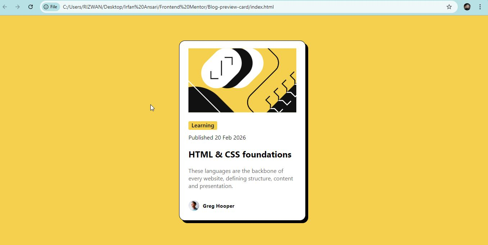

# Frontend Mentor - Blog Preview Card Solution

This is my solution to the Blog Preview Card challenge on Frontend Mentor. This project helped me improve my HTML and CSS skills, especially in layout, spacing, and styling.

---

## Overview

### Links

* Solution URL: [https://github.com/IrfanAnsari21/blog-preview-card.git]
* Live Site URL: [https://irfanansari21.github.io/blog-preview-card/]

---

### Screenshot

---

## Built with

* Semantic HTML5
* CSS3
* Flexbox

---

## What I learned

* How to structure a card layout using HTML
* How to use Flexbox for alignment
* Improved understanding of spacing (margin and padding)
* How to create hover effects using CSS

---

## Challenges I faced

* Aligning elements properly inside the card
* Managing spacing between text and image
* Implementing hover effects correctly

---

## Continued development

* Improve my CSS positioning and layout skills
* Learn more about responsive design
* Write cleaner and more maintainable CSS

---

## Author

* Frontend Mentor - [@IrfanAnsari21](https://www.frontendmentor.io/profile/IrfanAnsari21)
* GitHub - [@IrfanAnsari21](https://github.com/IrfanAnsari21)

---

## Acknowledgments

Thanks to Frontend Mentor for providing this project to help improve front-end development skills.
